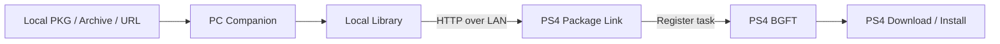

<div align="center">

# PS4 Package Link

**A native PS4 homebrew app and Windows companion for managing and installing your own PS4 PKG files over the local network.**


</div>

PS4 Package Link lets a Windows PC act as a local PKG library for a compatible jailbroken PS4. Add packages on the PC, browse them from the console, and hand the selected package to the PS4 system download/install service without copying it to USB first.

The project consists of two parts:

- **PS4 Package Link** — native OpenOrbis application for PS4.
- **PC Companion** — Windows application that manages the local library and serves PKGs to the console over LAN.

> [!IMPORTANT]
> PS4 Package Link is intended for **homebrew and PKG files you own or are authorized to use**. It does not provide retail games, bypass licenses/DRM, or require PSN credentials.

## Preview


## Features

### PS4 app

- Browse the package library hosted by the PC Companion.
- Connect to a PC using a configurable IPv4 address and port.
- Start package downloads through the PS4 BGFT/AppInstUtil pipeline.
- Display transfer progress while the package is being served from the PC.
- On-screen numeric keyboard for IP/port configuration.
- Persistent connection settings stored in `/data/ps4-package-link/config.txt`.
- Native controller navigation.
- Polish and English builds.
- Current connected build uses the PS4 **mini-app** category (`gde`), allowing it to coexist with a running game on supported setups.

### PC Companion

- Local PKG library with metadata, icons, versions, sizes and package types.
- **Add PKG...** for a normal extracted `.pkg`.
- **Add Game...** for games distributed as multiple files or archives.
- Queue a selected package for PS4.
- Download a PKG from a direct URL into the local library.
- Optional `apps.json` catalog for small homebrew/apps.
- Always-visible Activity Console.
- HTTP Range / `206 Partial Content` support for PS4 transfers.
- Hide a package from the list without deleting it.
- Permanently delete a PKG from the local library with confirmation.
- Restore hidden entries with **Show hidden**.

## How it works



The PC Companion serves package data over HTTP. The PS4 app reads the companion library, creates a BGFT task using the package metadata/reference JSON, and the PS4 downloads the data directly from the PC.

No PSN account or PSN credentials are used by PS4 Package Link.

## Requirements

### PS4

- Compatible jailbroken PS4 / GoldHEN environment.
- PS4 and PC connected to the same local network.
- Enough free storage for the package being installed.

### Windows PC

- Windows 10/11.
- Python 3 with Tkinter for the PC Companion.
- Optional: **7-Zip** for `.rar`, `.7z` and multipart archive imports.

For building the PS4 application from source you also need the **OpenOrbis PS4 Toolchain** with the required Windows tools and LLVM/Clang.

## Quick start

### 1. Start the PC Companion

From the project directory:

```bat
pc_companion\run.bat
```

For a visible Python/debug console:

```bat
pc_companion\run_debug.bat
```

The default HTTP port is:

```text
8765
```

Optional UDP discovery uses:

```text
8766
```

Allow the application through Windows Firewall on your **private/local network** if prompted.

### 2. Add packages

For a normal package, click:

```text
Add PKG...
```

For a game/archive/split package, use:

```text
Add Game...
```

### 3. Install the PS4 app

Install one of the release PKGs on the PS4:

```text
ps4packagelink_en.pkg
ps4packagelink_pl.pkg
```

Both language variants use the same Title ID and replace one another. Existing Package Link settings are preserved.

### 4. Connect the PS4 to the PC

Open **Settings** in PS4 Package Link and enter the PC's local IPv4 address and the companion port.

Example:

```text
192.168.1.100:8765
```

Then open the connection/library view and refresh the package list.

### 5. Install a package

Select a package in the PS4 library and press **X** to submit it to the PS4 download service.

Keep the PC Companion running until the transfer has finished.

> [!NOTE]
> `100%` in Package Link means the package data has been transferred. The PS4 may still be finalizing the installation. Check the normal PS4 notifications/download screen for the final system result.

## PS4 controls

| Control | Action |
| --- | --- |
| `L1 / R1` | Change tab |
| `D-Pad` | Navigate lists/settings |
| `X` | Select / connect / install / open keyboard |
| `Square` | Refresh library or save settings, depending on screen |
| `Circle` | Back to the previous Package Link screen |

### On-screen keyboard

| Control | Action |
| --- | --- |
| `D-Pad` | Select key |
| `X` | Enter selected key |
| `Square` | Delete character |
| `L2` | Clear field |
| `Triangle` | Confirm |
| `Circle` | Cancel |

On the Package Link home screen, close the application from the **PS button menu** rather than using an in-app direct exit. This avoids a known OpenOrbis/runtime exit issue seen during development.

## Game import

**Add Game...** supports the following local inputs:

```text
Game.pkg

Base.pkg
Update.pkg
DLC.pkg

Game.zip
Game.rar
Game.7z

Game.part1.rar
Game.part2.rar
...

Game.7z.001
Game.7z.002
...

Game.zip.001
Game.zip.002
...

Game.pkg.0
Game.pkg.1
...

Game.pkg.001
Game.pkg.002
...
```

Multiple normal `.pkg` files are imported separately because they may represent a base game, update or DLC.

Only explicit byte-split files such as `*.pkg.0`, `*.pkg.1`, etc. are automatically reassembled into one PKG and validated before being added to the library.

### Archive support

- `.zip` — handled directly by the companion.
- `.rar`, `.7z`, multipart archives — require 7-Zip.

The companion checks the normal Windows 7-Zip location and `PATH`. You can also set:

```text
SEVENZIP=C:\Program Files\7-Zip\7z.exe
```

## Downloads & catalog

The **Downloads & catalog** section is intentionally separate from game import.

### Direct PKG URL

Paste a direct `http://` or `https://` link to a PKG and optionally give it a custom filename. The companion downloads it into the local package library.

### `apps.json`

`apps.json` is designed for small apps/homebrew with a single PKG URL. It intentionally does **not** contain archive or multipart logic.

Example:

```json
{
  "version": 1,
  "apps": [
    {
      "id": "my-homebrew",
      "name": "My Homebrew",
      "category": "Homebrew",
      "pkg_url": "https://example.com/MyHomebrew.pkg",
      "image": "https://example.com/MyHomebrew.png",
      "filename": "MyHomebrew.pkg",
      "description": "Optional description"
    }
  ]
}
```

Images can also use a local path relative to the companion directory, for example:

```json
"image": "artwork/MyHomebrew.png"
```

## Local library actions

**Remove from List** hides the entry from the normal PC list but keeps the `.pkg` file on disk.

**Restore to List** makes a hidden package visible again.

**Delete PKG from Library** permanently deletes the local `.pkg` after confirmation.

## Network protocol

Default ports:

| Service | Port |
| --- | ---: |
| HTTP | `8765` |
| UDP discovery | `8766` |

Main endpoints:

```text
GET  /api/v1/status
GET  /api/v1/library
GET  /api/v1/library.txt
GET  /api/v1/pending.txt
POST /api/v1/pending
POST /api/v1/pending/ack
GET  /pkg/<id>
HEAD /pkg/<id>
GET  /ref/<id>.json
```

`/pkg/<id>` supports HTTP Range requests and `206 Partial Content` responses.

See [`docs/PROTOCOL.md`](docs/PROTOCOL.md) for the compact protocol reference.

## Building the PS4 app

### OpenOrbis setup

Set `OO_PS4_TOOLCHAIN` to your OpenOrbis installation, for example:

```bat
setx OO_PS4_TOOLCHAIN "C:\OpenOrbis\PS4Toolchain"
```

Open a new terminal after changing the environment variable.

### Current connected/mini-app build

The current release build path is the PowerShell builder used during hardware bring-up. Example English build:

```powershell
powershell -ExecutionPolicy Bypass -File .\ps4_app\build_minimal_windows.ps1 `
  -Toolchain "$env:OO_PS4_TOOLCHAIN" `
  -OriginalAuthInfo `
  -VideoFileTrace `
  -LoadVideoModule `
  -Video1080p `
  -ConnectedUI `
  -Language en
```

For Polish:

```powershell
powershell -ExecutionPolicy Bypass -File .\ps4_app\build_minimal_windows.ps1 `
  -Toolchain "$env:OO_PS4_TOOLCHAIN" `
  -OriginalAuthInfo `
  -VideoFileTrace `
  -LoadVideoModule `
  -Video1080p `
  -ConnectedUI `
  -Language pl
```

The connected build sets the package category to `gde` and generates the PKG in a new directory under:

```text
ps4_app\diagnostic_builds\
```

The directory name is historical from the staged PS4 bring-up process; it is currently also used to produce the known-working connected build.

## Project layout

```text
PS4-Package-Link/
├─ pc_companion/
│  ├─ companion.py
│  ├─ run.bat
│  ├─ run_debug.bat
│  ├─ apps.json
│  └─ apps.example.json
├─ ps4_app/
│  ├─ source/
│  │  ├─ main.cpp
│  │  ├─ connected_ui.h
│  │  ├─ install_ui.h
│  │  ├─ ui_language.h
│  │  └─ asm.s
│  ├─ build_minimal_windows.ps1
│  ├─ build_windows.bat
│  └─ Makefile
├─ docs/
│  ├─ PROTOCOL.md
│  └─ companion-ui-preview.png
└─ README.md
```

## Current behavior / notes

- The PC Companion must remain available while a PS4 transfer is active.
- Package Link does not automatically uninstall an existing application before installing another package.
- A package already submitted during the current Package Link session is not submitted a second time.
- Existing BGFT task state is not reconstructed inside Package Link after restarting the app; use the PS4 system download/notification UI to inspect an already-running task.
- Firmware, GoldHEN and homebrew runtime differences can affect BGFT/AppInstUtil behavior.
- Do not expose the companion HTTP port directly to the public internet. It is designed for a trusted local network.

## Package identity

```text
Title ID:   BREW05001
Content ID: IV0000-BREW05001_00-PS4PACKAGELINK00
Version:    0.6.4
```

## Credits

PS4 Package Link builds on research and tooling from the PS4 homebrew community, including:

- [OpenOrbis PS4 Toolchain](https://github.com/OpenOrbis/OpenOrbis-PS4-Toolchain)
- [flatz/ps4_remote_pkg_installer](https://github.com/flatz/ps4_remote_pkg_installer)
- [LightningMods/PS4-Store](https://github.com/LightningMods/PS4-Store)

Thanks to the developers and researchers who documented PS4 package, BGFT and homebrew behavior.

## Disclaimer

This project is not affiliated with or endorsed by Sony Interactive Entertainment.

Use PS4 Package Link only with software and package files that you have the right to use. The project is intended as a local homebrew/development utility and does not include copyrighted commercial games or a mechanism for bypassing software licensing.
